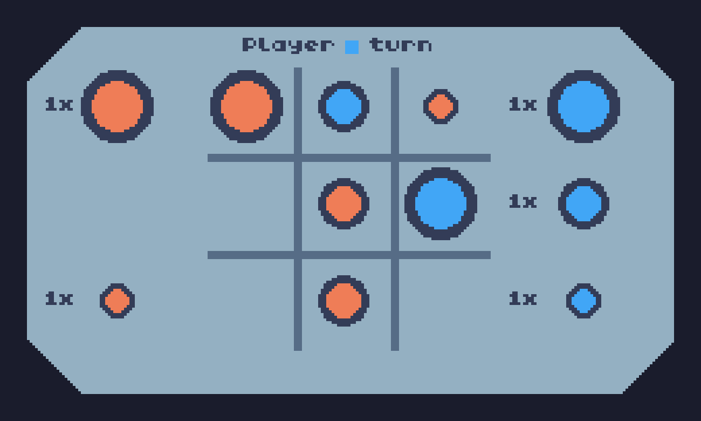

# Stacked Tic-Tac-Toe

Just like regular tic tac toe, but you can put a larger piece on top of a
smaller one! This an interesting twist on a the classic game.

You can try it out here: https://rokaspuzonas.github.io/stacked-tic-tac-toe

This was made using [TIC-80](https://tic80.com)
